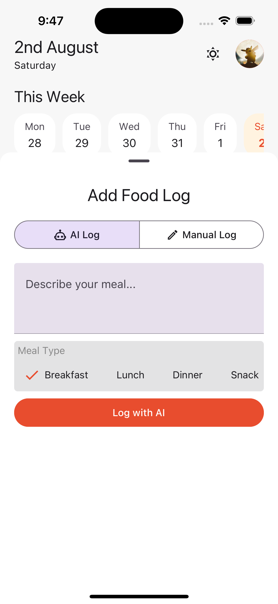
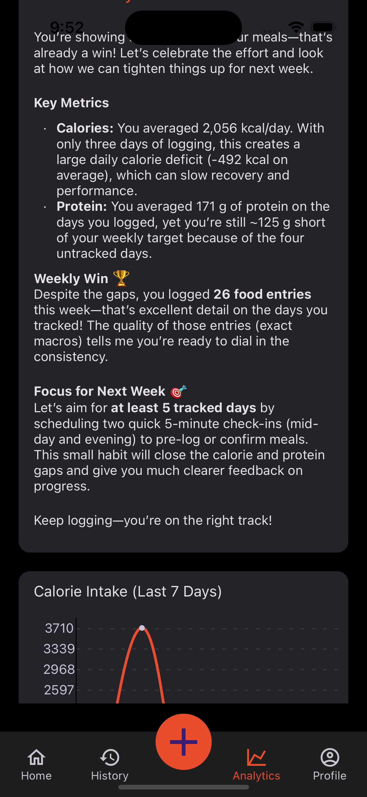

# MACRO-CHECK – An AI-Powered Macro Tracker

Macro-Check is a modern, cross-platform mobile application designed to **simplify nutritional tracking**.  
It combines a **user-friendly interface** with a **powerful AI backend** to provide an intelligent and seamless experience for users looking to manage their diet and achieve their health goals.

This repository contains the **complete source code** for both the **mobile application frontend** and the **API backend**.

---

## ✨ What It Does: Core Features

### 🤖 AI-Powered Food Logging
- Log meals in **plain English** (e.g., _"a bowl of oatmeal with berries and protein powder"_).
- The AI backend parses the input, estimates nutritional values, and enriches the description before saving it.

### ✍️ Manual Entry
- For precise tracking, users can **manually log their macros** if they know exact values.

### 📊 Daily Dashboard
- View **at-a-glance summaries** of your daily progress.
- Compare actual intake vs. set goals with **visual charts and progress bars**.

### 🎯 Goal Setting
- Set **daily targets** for calories, protein, carbs, and fat.
- Get real-time feedback and **adjust based on your progress**.

### 📅 History & Analytics
- Review logs for any date using a **calendar view**.
- Analyze trends with a **7-day overview** and **AI-generated insights** offering actionable advice.

### 🔐 Secure Authentication
- Sign up and log in using **email/password** or **Google OAuth**.
- Authentication is securely managed by **Supabase Auth**.

### 🎨 Theming
- **Dark mode by default** for a sleek look.
- Optional **light mode with a vibrant orange theme**.

### 📤 Export to Sheets *(Planned)*
- Export your data to Google Sheets or CSV for external analysis.

---

## 📱 App Preview

> *(Screenshots of the application's key features)*

## Light Mode
| Onboarding | Dashboard | Food Logging | Analytics | History | Login |
|------------|-----------|--------------|-----------|----------|--------|
|  |  |  |  |  |  |

## Dark Mode
| Dashboard | Food Logging | Analytics | History | Login |
|-----------|--------------|-----------|----------|--------|
|  |  |  |  |  |

---

## 🛠️ Tech Stack

### Backend
- **Framework:** [FastAPI](https://fastapi.tiangolo.com/) (Python)
- **Database:** [PostgreSQL (Supabase)](https://supabase.io/)
- **Authentication:** Supabase Auth
- **Caching:** Redis
- **AI/LLM:** Gemini / Kimi via [OpenRouter API](https://openrouter.ai/)
- **Data Validation:** Pydantic
- **Containerization:** Docker & Docker Compose

### Frontend
- **Framework:** [React Native (Expo)](https://expo.dev/) with TypeScript
- **Navigation:** React Navigation
- **State Management (Server):** TanStack Query (React Query)
- **State Management (Client):** Zustand
- **Authentication Client:** Supabase JS
- **UI Libraries:** React Native Paper & React Native Reusables
- **Animations:** Lottie

---

## 🏗️ System Architecture

Macro-check follows a **modern three-tier architecture**:

### 1️⃣ Frontend (React Native App)
- Provides the **UI for user interactions**.
- Handles **authentication** directly with Supabase Auth.
- For all other data (logs, goals, analytics), it **communicates with the FastAPI backend** via authenticated requests.

### 2️⃣ Backend (FastAPI Server)
- Acts as the **"brain" of the application**.
- Responsibilities include:
  - Securely integrating with the **OpenRouter API** for AI-powered insights.
  - Calculating daily and weekly **analytics**.
  - Managing the **Redis cache** for performance.
  - Handling database operations for user logs, goals, and history.

### 3️⃣ Third-Party Services (Supabase)
- **Supabase Auth** – Handles email/password logins, Google OAuth, password hashing, and JWT generation.
- **Supabase Database** – Provides a production-ready managed PostgreSQL database for application data.

This decoupled design ensures:
- **Scalability** – Each layer can grow independently.
- **Security** – Authentication is delegated to Supabase.
- **Maintainability** – Clear separation of concerns.

---

## 🚀 Getting Started

### Prerequisites
- Node.js (v18+)
- Python 3.11+
- Docker & Docker Compose
- Supabase account
- OpenRouter API key

## 🛠️ Setup Instructions

For detailed setup instructions:
1. Check the `/macro_tracker` directory for API server setup
2. Check the `/macro-check-client` directory for mobile app setup

Each directory contains its own README with environment configuration and development guidelines.

